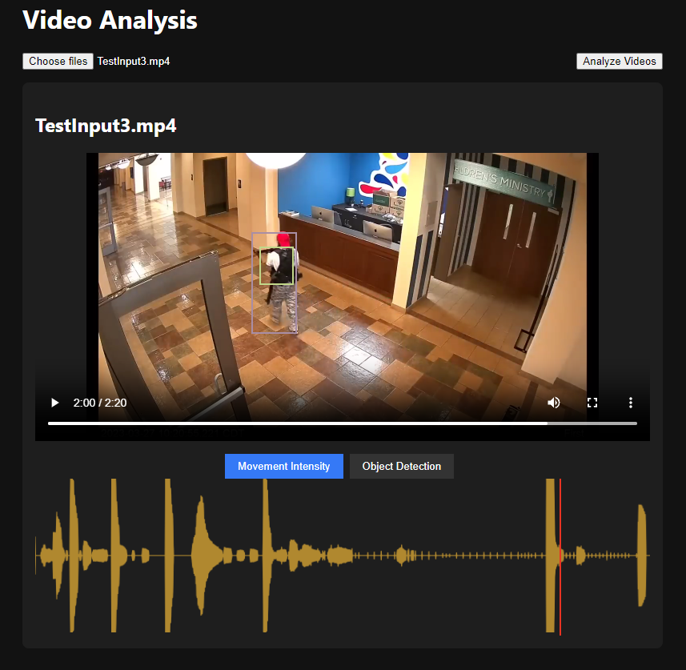

# Object_Detector
Detects object using DETR (End-to-End Object Detection with Transformers)

https://huggingface.co/facebook/detr-resnet-50




## Install & Start
Make sure you have installed:
- Node.js
- Python
- npm

Backend Python server:
```
cd ./SRC
pip install -r requirements.txt
python server.py
```
Frontend React:
```
cd ./SRC/webapp
npm install
npm start
```